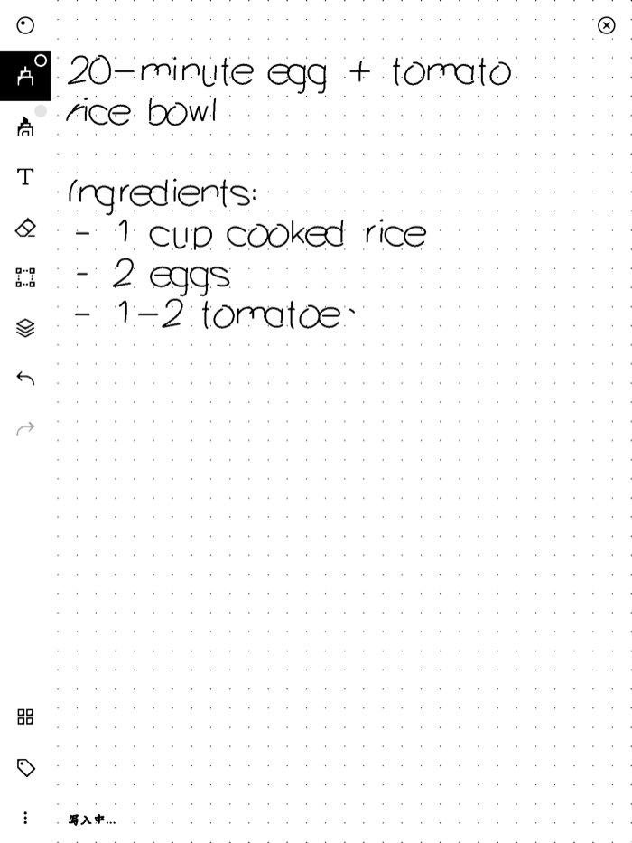
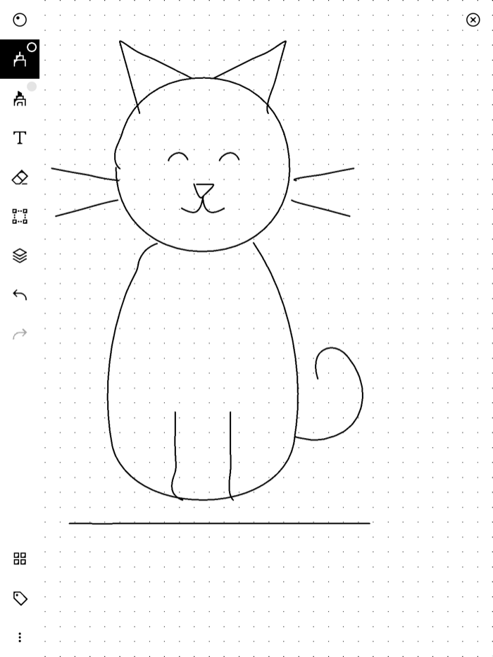
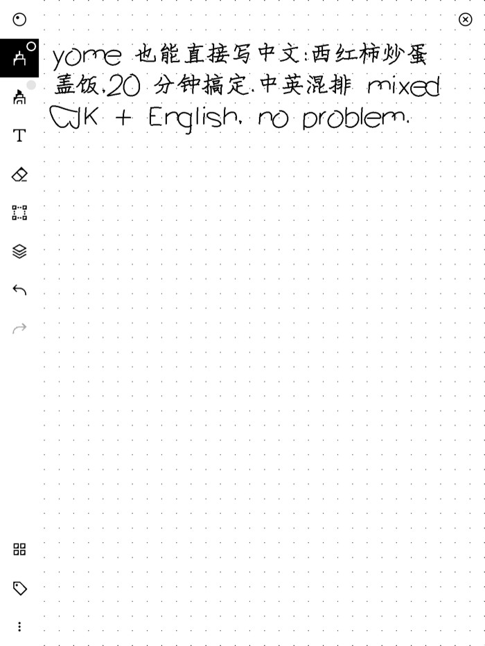

# yome — rm2-ai-daemon

**English** | [简体中文](README.zh-CN.md)

An AI assistant that runs natively on the reMarkable 2. Handwrite a page in
xochitl (the stock note-taking UI), trigger it with a corner gesture, and the
AI reads the page, decides what the task is (polish prose / organize a todo
list / redraw a messy sketch / answer a question), then **writes the result
back as ink** — right on the device, no computer or phone in the loop.

<p align="center">
  
  
</p>
<p align="center"><i>Left: a handwritten question. Right: the AI's answer, written back as pen strokes — real screen captures.</i></p>

```
handwrite a page → corner gesture → agent (see → decide → act) → result written as ink
```

The core design idea: **the agent's tools are its hands** — each model tool
call maps directly to an injection action on the device (write text, draw,
turn the page), closing the perceive–decide–act loop on the device itself.

Full design in [docs/plan.md](docs/plan.md) (Chinese); task breakdown in
[docs/dev-plan.md](docs/dev-plan.md).

## Status

- **M0–M2 complete** — write-back engine, screen capture, UI automation, and
  single-turn perception verified on a real device with a real model.
- **M3: core acceptance passed** — the full loop above (real model, real
  finger gesture, answer written to a new page) works end to end. Remaining:
  redraw/in-place acceptance runs and fault-injection tests.
- **M4 polish in progress** — bottom-edge status line, session cancel
  gesture, and user pen-style restore are done.

Details (in Chinese) in [docs/progress.md](docs/progress.md).

## Using it

Run the resident daemon (`rm2-ai-daemon serve`, installed as a systemd unit),
then from any notebook page:

- **Double-tap the bottom-right corner** → the agent reads the page and
  writes its result to a fresh page.
- **Double-tap, holding the second tap ~1.5s** → in-place mode: the page is
  backed up byte-for-byte, erased, and rewritten.
- **Double-tap again while a session runs** → cancel.

While a session runs, a small hourglass ⧗ marks the corner and a status line
at the bottom edge tracks the phase — thinking, writing, drawing, reading the
page, erasing:

<p align="center">
  
</p>
<p align="center"><i>Mid-session: the answer appears stroke by stroke; the bottom-left corner shows the status line (写入中… = writing).</i></p>

The agent can also draw — SVG paths are flattened to polylines and injected
as pen strokes — and writes Chinese alongside English (single-line Hershey
fonts for Latin, stroke medians from makemeahanzi for CJK):

<p align="center">
  
  
</p>

## How it works

It talks to xochitl only through **standard kernel interfaces** — no
patching, no function hooking, no toltec dependency:

| Module | Approach |
|---|---|
| `inject` | writes synthetic pen events to the Wacom evdev device — xochitl can't tell them from real strokes |
| `capture` | locates the framebuffer in xochitl's process memory and reads frames (the project's single internal coupling point) |
| `layout` | text → Hershey single-line font strokes; SVG paths → Bézier flattening → polylines. Both feed the same injection pipeline |
| `ui` | drives xochitl's own UI (switch pen / undo / clear page) via a per-firmware UI map plus pixel probes |

Two key findings from on-device testing (M0):

- **Handwriting feel = pressure envelope.** Constant-pressure injection makes
  a uniform thin line that reads as fake at a glance; with pressed attack →
  full-pressure middle → tapering release, xochitl's pressure-sensitive brush
  renders varying width close to a human hand.
- **Injected ink renders with whatever tool xochitl has selected.** If the
  user last used the eraser, injecting means erasing — zero effect and zero
  errors on a blank page. So every write **forces a pen selection with probe
  confirmation** first, and **verifies ink** afterwards.

## Quick start

Connect the device over USB (`10.11.99.1`); the SSH password is on the
device under Settings → Help → Copyrights.

```bash
git clone git@github.com:momaek/yome.git
cd yome

make check      # gofmt + go vet + unit tests (all run off-device)
make build      # cross-compile → build/rm2-ai-daemon (static ARM binary)
make deploy     # scp to the device
make install    # deploy + seed /home/root/.config/rm2-ai/config.toml + install the systemd unit
```

Use `make deploy DEVICE=root@192.168.1.50` to go over wifi.

For gesture-triggered sessions, set your API endpoint and key in the
`[api]` section of the config (`provider`, `model`, `api_key`, and
`base_url` for OpenAI-compatible endpoints), then:

```bash
ssh root@10.11.99.1 systemctl start rm2-ai
journalctl -u rm2-ai -f        # on the device: watch the session log
```

The CLI debug commands below need no config and no API key.

## CLI debug commands

Every subsystem is drivable as a foreground command:

```bash
# one perceive-decide-act session from the command line (no gesture needed)
rm2-ai-daemon ai -debug

# typeset text and write it on the current page (word wrap; ink verified after)
rm2-ai-daemon write-text -text "hello from the daemon" -debug

# layout preview + page character budget without touching the device — runs anywhere
rm2-ai-daemon write-text -file notes.txt -dry-run

# screenshot (portrait orientation, with a black-pixel count)
rm2-ai-daemon capture -out /tmp/page.png

# draw an SVG (paths flattened to polylines)
rm2-ai-daemon draw-svg -file cat.svg -width 600

# UI-map operations
rm2-ai-daemon ui-run -list
rm2-ai-daemon ui-run -feature select_pen
rm2-ai-daemon ui-run -feature select_pen_type -params pen_type=pen_marker
rm2-ai-daemon probe -name toolbar_open
rm2-ai-daemon erase-page -yes        # destructive: clears the current page

# gesture calibration: print recognised corner gestures
rm2-ai-daemon trigger

# raw input: tap / swipe / event dump / device enumeration
rm2-ai-daemon tap -x 700 -y 900
rm2-ai-daemon swipe -x0 1100 -y0 900 -x1 300 -y1 900
rm2-ai-daemon record -name touch
rm2-ai-daemon devices
```

All commands accept `-debug` (verbose logging) and `-config <path>`.

## Configuration

`/home/root/.config/rm2-ai/config.toml`; every field is documented in
[deploy/config.example.toml](deploy/config.example.toml).

The defaults are the values calibrated on a real device in M0 (coordinate
mapping, point spacing, pressure envelope, UI timings) — tuning means editing
the config, not recompiling. If the file is missing, defaults apply and the
CLI debug commands work with zero configuration.

> **About secrets**: everything on the rM2 runs as root, so file permissions
> protect nothing. The real risks are losing the device and the USB web
> interface — not other local users.

## Project layout

```
cmd/rm2-ai-daemon/     CLI entry point, debug commands, serve daemon, agent session
internal/
  geom/                coordinate primitives (point / stroke / rect / clip) — screen space
  layout/              Hershey fonts, CJK stroke medians, SVG path parsing, typesetting
  inject/              evdev pen/touch event synthesis, coordinate mapping, pressure envelope
  capture/             framebuffer capture from xochitl process memory
  trigger/             corner-gesture detection (double tap / long press / cancel)
  llm/                 provider adapters (anthropic / openai-compatible), vision requests
  penstate/            save & restore the user's pen selection
  ui/                  UI map + pixel probes + tap state machine
  config/              TOML config (defaults = M0 calibration constants)
assets/                go:embed data: fonts, CJK medians, per-firmware UI maps
deploy/                config.example.toml, systemd unit
docs/                  design docs, dev plan, UI map archives, progress log
```

## Development

```bash
make test           # unit tests
make test-update    # refresh golden files
make check          # everything CI runs
```

All unit tests run off-device: coordinate mapping, pressure envelopes,
JHF/SVG parsing, Bézier flattening, line wrapping, and the UI state machine
(with a fake screen and fake tapper) are pure logic. evdev and `/proc` access
sit behind a `linux` build tag, so the project compiles and tests anywhere;
only the code paths that actually touch the device return errors elsewhere.

**The device is the only authority**: each milestone is accepted on real
hardware, with `capture` + black-pixel fingerprints as automated assertions.

## License

TODO
